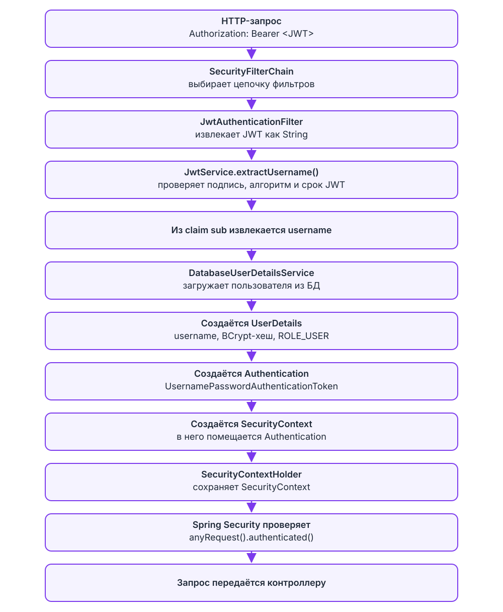

# Этап 8. Вход и JWT-аутентификация

## Добавленные и изменённые классы и файлы

| Статус | Класс или файл | Что сделано |
|---|---|---|
| Новый | `LoginRequest` | Принимает и проверяет `username` и `password` для входа |
| Новый | `LoginResponse` | Возвращает JWT, тип `Bearer` и срок действия в секундах |
| Новый | `DatabaseUserDetailsService` | Загружает пользователя и его актуальную роль из PostgreSQL для Spring Security |
| Новый | `JwtService` | Выпускает и проверяет JWT с подписью `HS256`, `sub`, `iat` и `exp` |
| Новый | `JwtAuthenticationFilter` | Извлекает Bearer-токен и создаёт `Authentication` для защищённого запроса |
| Новый | `SecurityErrorResponseWriter` | Записывает ошибки Spring Security в общий JSON-формат |
| Новый | `RestAuthenticationEntryPoint` | Возвращает единый `401 Unauthorized` для неаутентифицированного запроса |
| Новый | `RestAccessDeniedHandler` | Возвращает единый `403 Forbidden`, когда прав пользователя недостаточно |
| Изменён | `AuthController` | Добавлен endpoint `POST /api/auth/login` |
| Изменён | `AuthService` | Добавлены проверка учётных данных и выпуск JWT после успешного входа |
| Изменён | `SecurityConfig` | Настроены `AuthenticationManager`, stateless-режим, публичные endpoints и JWT-фильтр |
| Изменён | `ApiExceptionHandler` | Ошибка входа преобразуется в безопасный `401` без уточнения неверного поля |
| Изменён | `pom.xml` | Добавлены модули JJWT версии `0.13.0` |
| Изменён | `application.properties`, `.env.example` | Добавлены срок действия токена и переменная `JWT_SECRET` |
| Новый | `AuthLoginIntegrationTest` | Проверяет вход и Bearer-аутентификацию через полный стек приложения |
| Новый | `JwtServiceTest` | Проверяет выпуск токена, срок действия и требования к секрету |
| Новый | `SecurityErrorHandlersTest` | Проверяет безопасный JSON ошибок `401` и `403` |
| Новый | `application-test.properties` | Содержит отдельный тестовый ключ, не используемый приложением |
| Изменён | `OrderServiceApplicationTests`, `AuthRegistrationIntegrationTest` | Подключён профиль с тестовым JWT-секретом |



## Путь запроса на вход

| Шаг | Участник                     | Что происходит                                                                               |
| --: | ---------------------------- | -------------------------------------------------------------------------------------------- |
|   1 | Клиент                       | Отправляет `POST /api/auth/login` с JSON, содержащим `username` и `password`                 |
|   2 | `SecurityFilterChain`        | Пропускает публичный endpoint входа без JWT и без сессии                                     |
|   3 | `AuthController`             | Jackson создаёт `LoginRequest`, а `@Valid` запускает Bean Validation                         |
|   4 | `AuthService`                | Приводит username к нижнему регистру и создаёт неаутентифицированный объект `Authentication` |
|   5 | `AuthenticationManager`      | Передаёт запрос настроенному `DaoAuthenticationProvider`                                     |
|   6 | `DatabaseUserDetailsService` | Через `UserRepository` загружает пользователя из PostgreSQL                                  |
|   7 | `DaoAuthenticationProvider`  | С помощью `PasswordEncoder` сравнивает исходный пароль с BCrypt-хешем                        |
|   8 | `JwtService`                 | После успешной проверки создаёт JWT и подписывает его ключом `HS256`                         |
|   9 | `AuthService`                | Формирует `LoginResponse` с токеном, типом `Bearer` и `expiresIn = 1800`                     |
|  10 | Клиент                       | Получает `200 OK` и использует токен в заголовке последующих запросов                        |

```text
POST /api/auth/login
          ↓
SecurityFilterChain: endpoint разрешён без JWT
          ↓
AuthController + Bean Validation
          ↓
AuthService: нормализация username
          ↓
AuthenticationManager
          ↓
DaoAuthenticationProvider
          ↓
DatabaseUserDetailsService → UserRepository → PostgreSQL
          ↓
PasswordEncoder.matches(rawPassword, passwordHash)
          ↓
JwtService: sub + iat + exp + подпись HS256
          ↓
LoginResponse → 200 OK
```

## Результат

`POST /api/auth/login` проверяет зарегистрированного пользователя и возвращает подписанный JWT. Защищённые запросы принимают токен из заголовка `Authorization: Bearer <token>`.

Приложение больше не использует временного пользователя и сгенерированный пароль Spring Boot. Пользователь загружается из таблицы `users`, а его пароль проверяется по существующему BCrypt-хешу.

Без токена, с испорченным токеном или с истёкшим сроком действия защищённый запрос получает единообразный `401 Unauthorized`. Если пользователь аутентифицирован, но его роль не разрешает операцию, используется единообразный `403 Forbidden`.

## Контракт входа

Запрос:

```http
POST /api/auth/login
Content-Type: application/json
```

```json
{
  "username": "user_1",
  "password": "strong-password"
}
```

Успешный ответ:

```http
HTTP/1.1 200 OK
Content-Type: application/json
```

```json
{
  "token": "<jwt>",
  "tokenType": "Bearer",
  "expiresIn": 1800
}
```

`LoginRequest` повторяет правила username и password, использованные при регистрации. Это не позволяет передать пустые поля, некорректный username или пароль, превышающий ограничение BCrypt в 72 байта.

Username нормализуется через:

```java
request.getUsername().toLowerCase(Locale.ROOT)
```

Поэтому пользователь, зарегистрированный как `user_1`, может ввести `USER_1`: поиск всё равно выполняется по нормализованному значению `user_1`.

## Проверка username и password

`AuthService` не сравнивает пароль самостоятельно. Он создаёт объект, содержащий предъявленные учётные данные:

```java
UsernamePasswordAuthenticationToken.unauthenticated(
        normalizedUsername,
        request.getPassword())
```

Этот объект является запросом на аутентификацию. Он ещё не доказывает, что пользователь действительно вошёл.

Далее объект передаётся в `AuthenticationManager`. В конфигурации менеджер представлен `ProviderManager`, которому назначен `DaoAuthenticationProvider`.

`DaoAuthenticationProvider` выполняет две основные операции:

1. вызывает `DatabaseUserDetailsService.loadUserByUsername()`;
2. передаёт исходный пароль и сохранённый BCrypt-хеш в `PasswordEncoder.matches()`.

При успехе возвращается новый аутентифицированный объект `Authentication`. При неизвестном username или неправильном пароле возникает `AuthenticationException`.

Оба негативных сценария возвращают одинаковый ответ:

```json
{
  "timestamp": "2026-09-09T00:00:00Z",
  "status": 401,
  "error": "Unauthorized",
  "message": "Неверные учётные данные",
  "path": "/api/auth/login"
}
```

Ответ намеренно не сообщает, существует ли такой username. Иначе API помогал бы подбирать зарегистрированные имена пользователей.

## `DatabaseUserDetailsService`

`DatabaseUserDetailsService` реализует стандартный интерфейс Spring Security:

```java
public class DatabaseUserDetailsService implements UserDetailsService
```

Метод `loadUserByUsername()` преобразует доменную Entity `User` в объект `UserDetails`:

- `username` становится именем principal;
- `passwordHash` передаётся Spring Security для BCrypt-проверки;
- роль `USER` преобразуется в authority `ROLE_USER`;
- роль `ADMIN` преобразуется в authority `ROLE_ADMIN`.

`@Transactional(readOnly = true)` открывает транзакцию только для чтения пользователя. Метод не изменяет таблицу `users`.

Пароль и хеш не попадают в HTTP-ответ и не записываются в JWT.

## Структура JWT

JWT состоит из трёх Base64URL-частей, разделённых точками:

```text
header.payload.signature
```

### Header

Header сообщает тип токена и алгоритм подписи:

```json
{
  "alg": "HS256"
}
```

### Payload

Приложение записывает только стандартные claims:

```json
{
  "sub": "user_1",
  "iat": 1788900000,
  "exp": 1788901800
}
```

- `sub` — username;
- `iat` — момент выпуска;
- `exp` — момент окончания действия;
- разница между `exp` и `iat` составляет 1800 секунд.

Роль не помещается в JWT. Во время каждого защищённого запроса приложение снова загружает пользователя из базы. Благодаря этому используются актуальные полномочия, а токен удалённого пользователя перестаёт работать.

JWT подписан, но не зашифрован. Payload можно прочитать без секрета, поэтому секретные данные в него помещать нельзя.

### Signature

Подпись позволяет обнаружить изменение header или payload. `JwtService` явно разрешает при проверке только `HS256` и использует тот же секретный ключ, которым токен был подписан.

Изменение хотя бы одного символа токена нарушает подпись. Такой токен нельзя считать доверенным.

## JWT-секрет

Секрет передаётся через переменную окружения:

```text
JWT_SECRET
```

Значение должно быть строкой Base64. После декодирования ключ должен занимать не менее 32 байт, то есть 256 бит — минимальный размер ключа для `HS256`.

Создать случайный локальный ключ можно командой:

```bash
openssl rand -base64 32
```

Полученный результат нужно записать в локальный `.env`:

```properties
JWT_SECRET=<результат команды>
```

Файл `.env` не отслеживается Git. В репозитории хранится только `.env.example` без рабочего секрета.

`@Value("${jwt.secret}")` и `@Value("${jwt.expiration-seconds}")` передают настройки в конструктор `JwtService`. Если секрет отсутствует, имеет неверный Base64-формат или после декодирования короче 32 байт, Spring Context не запускается. Это fail-fast поведение: приложение не должно работать с небезопасной конфигурацией.

## Путь защищённого запроса

```text
GET /защищённый-endpoint
Authorization: Bearer <token>
          ↓
SecurityFilterChain
          ↓
JwtAuthenticationFilter
          ↓
JwtService: формат + подпись HS256 + exp
          ↓
получение username из sub
          ↓
DatabaseUserDetailsService → UserRepository → PostgreSQL
          ↓
UsernamePasswordAuthenticationToken.authenticated(...)
          ↓
новый SecurityContext
          ↓
проверка правила доступа
          ↓
Controller
```

`JwtAuthenticationFilter` наследуется от `OncePerRequestFilter`. Spring вызывает такой фильтр не более одного раза в рамках обычной обработки одного запроса.

Фильтр работает следующим образом:

1. читает заголовок `Authorization`;
2. проверяет наличие схемы `Bearer`;
3. передаёт компактный JWT в `JwtService`;
4. проверяет подпись и `exp` до доверия данным payload;
5. получает username из `sub`;
6. загружает актуального пользователя из PostgreSQL;
7. создаёт аутентифицированный `UsernamePasswordAuthenticationToken`;
8. помещает его в новый `SecurityContext`;
9. продолжает цепочку фильтров.

Новый `SecurityContext` создаётся через `SecurityContextHolder.createEmptyContext()`. Это безопаснее прямого изменения уже существующего контекста и ясно показывает, что аутентификация относится к текущему запросу.

Фильтр перехватывает только ожидаемые ошибки токена и аутентификации. Например, ошибка соединения с PostgreSQL не маскируется под недействительный JWT и должна обрабатываться как внутренняя ошибка приложения.

## `SecurityFilterChain`

На этапе 8 цепочка безопасности получила окончательную основу для Bearer-аутентификации:

- `POST /api/auth/register` разрешён анонимному клиенту;
- `POST /api/auth/login` разрешён анонимному клиенту;
- остальные запросы требуют `Authentication`;
- `SessionCreationPolicy.STATELESS` запрещает использовать HTTP-сессию как хранилище входа;
- form login отключён;
- HTTP Basic отключён;
- logout endpoint Spring Security отключён, потому что сервер не хранит JWT-сессию;
- request cache отключён, потому что REST API не перенаправляет пользователя на HTML-форму;
- CSRF отключён для stateless API, где токен передаётся клиентом в заголовке `Authorization`;
- JWT-фильтр установлен перед `UsernamePasswordAuthenticationFilter`;
- внутренний `DispatcherType.ERROR` остаётся разрешённым, чтобы не заменять исходную серверную ошибку ответом безопасности.

Сервер не запоминает выданные токены. Каждый запрос должен заново предъявить JWT.

## `401 Unauthorized` и `403 Forbidden`

Эти ответы возникают внутри цепочки Spring Security, до выполнения контроллера. Поэтому одного `@RestControllerAdvice` недостаточно.

### `401 Unauthorized`

`RestAuthenticationEntryPoint` вызывается, когда защищённый endpoint получил запрос без подтверждённого пользователя:

```json
{
  "timestamp": "2026-09-09T00:00:00Z",
  "status": 401,
  "error": "Unauthorized",
  "message": "Требуется аутентификация",
  "path": "/api/orders"
}
```

Причиной может быть:

- отсутствующий заголовок;
- пустой Bearer-токен;
- нарушенная структура JWT;
- неправильная подпись;
- истёкший срок действия;
- отсутствие пользователя из `sub` в базе.

### `403 Forbidden`

`RestAccessDeniedHandler` предназначен для ситуации, когда пользователь уже аутентифицирован, но его authority не подходит для endpoint:

```json
{
  "timestamp": "2026-09-09T00:00:00Z",
  "status": 403,
  "error": "Forbidden",
  "message": "Доступ запрещён",
  "path": "/api/orders/all"
}
```

Ролевые правила конкретных административных endpoints будут добавлены на этапе 11. На этапе 8 уже подготовлен и проверен единый обработчик будущих `403`.

## Новые аннотации и механизмы

### `@Value`

Spring подставляет значение настройки в параметр конструктора. Без `@Value` обычный параметр `String` или `long` не связан с `application.properties`.

### `@Override`

Показывает, что метод реализует контракт интерфейса или родительского класса. Компилятор проверяет правильность сигнатуры.

### `@Transactional(readOnly = true)`

Создаёт транзакционную границу для чтения пользователя. `readOnly = true` сообщает, что метод не планирует изменять данные.

### `@ActiveProfiles("test")`

В тестах включает `application-test.properties`, чтобы использовать отдельный известный JWT-ключ. Рабочий `JWT_SECRET` тестам не нужен и не раскрывается.

### `@Import`

В интеграционный тест добавляет контроллер, существующий только для проверки защищённого запроса. Production endpoint следующего этапа ради теста не создаётся.

Остальные основные аннотации уже использовались раньше:

- `@Service` и `@Component` регистрируют классы как Spring Beans;
- `@Configuration` содержит настройки Spring Security;
- `@Bean` регистрирует `AuthenticationManager`, `PasswordEncoder` и `SecurityFilterChain`;
- `@PostMapping` связывает метод входа с HTTP endpoint;
- `@RequestBody` запускает преобразование JSON в `LoginRequest`;
- `@Valid` запускает ограничения Bean Validation.

## Тесты

`AuthLoginIntegrationTest` проходит настоящий путь через Security, Controller, Service, Repository и PostgreSQL. Он проверяет:

- успешный вход с username в другом регистре;
- ответ с полями `token`, `tokenType` и `expiresIn`;
- алгоритм `HS256`;
- `sub`, `iat`, `exp` и срок 1800 секунд;
- одинаковый безопасный `401` для неправильного пароля и неизвестного username;
- создание `Authentication` с authority `ROLE_USER`;
- `401` без токена;
- `401` для некорректного формата;
- `401` для изменённой подписи;
- `401` для просроченного токена;
- прекращение работы токена после удаления пользователя.

`JwtServiceTest` отдельно проверяет:

- выпуск и чтение токена;
- секрет короче 32 байт;
- неположительный срок действия;
- отклонение истёкшего токена.

`SecurityErrorHandlersTest` проверяет единый JSON и отсутствие внутренних сообщений исключений в ответах `401` и `403`.

Полная проверка проекта:

```bash
./mvnw test
```

Результат этапа: 36 тестов, 0 ошибок и 0 падений.

## Граница этапа

На этапе 8 не добавлялись:

- `GET /api/auth/me`;
- production endpoints заказов;
- ограничения административных URL по роли;
- создание первого администратора;
- refresh-токены;
- отзыв отдельных JWT до окончания их срока;
- Swagger и Docker.

Эти задачи принадлежат следующим этапам дорожной карты.

## Практическое задание

Нарисуйте путь защищённого запроса начиная с заголовка `Authorization` и заканчивая контроллером. Возле каждого шага подпишите, какой объект создаётся или проверяется: JWT, `UserDetails`, `Authentication`, `SecurityContext`.

Дополнительная практика: объясните, какой ответ должен вернуть защищённый endpoint в пяти случаях — токена нет, формат нарушен, подпись изменена, срок истёк, пользователь из `sub` удалён.

## Контрольные вопросы

1. Почему `AuthenticationManager` получает исходный пароль, а в базе при этом хранится только BCrypt-хеш?
2. Чем неаутентифицированный `UsernamePasswordAuthenticationToken` во время login отличается от аутентифицированного объекта, создаваемого JWT-фильтром?
3. Почему сначала нужно проверить подпись и срок JWT и только после этого доверять значению `sub`?
4. Зачем после проверки JWT снова загружать пользователя из PostgreSQL, если username уже присутствует в токене?
5. Чем `401 Unauthorized` отличается от `403 Forbidden` и какие компоненты формируют эти ответы?
